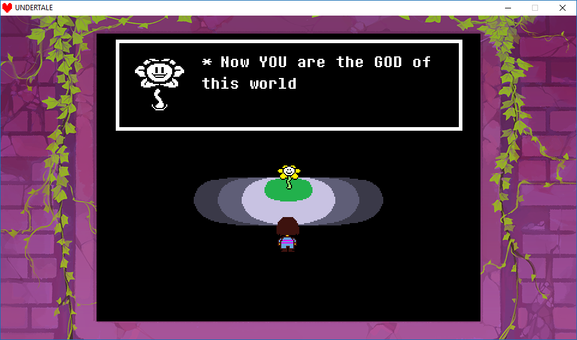
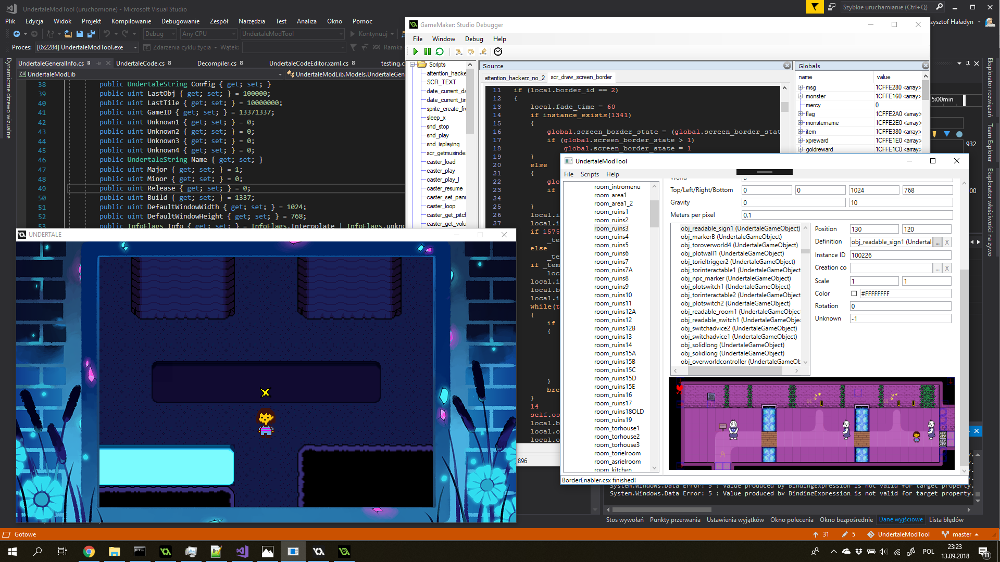

# UndertaleModTool
*(seeing such an amazing tool... 
... fills you with DETERMINATION)*

heya. I heard you like digging deep into Undertale data so I made a tool just for you! Downloads are here: https://github.com/krzys-h/UndertaleModTool/releases

### Main features
* Can read every single byte from the data file for lastest version of Undertale, and probably other GameMaker: Studio games (GM:S 1.4 bytecode version 15 or 16 only, version 14 may be supported at some point but not yet, partial GM:S2 support is done) for every platform and then recreate a byte-for-byte exact copy from the decoded data.
* Properly handles all of the pointers in the file so that if you add/remove stuff, make things longer/shorter, move them around etc. the file format won't break.
* An editor which lets you change (almost) every single value, including unknown ones. A lot better than a hex editor, huh?
* Includes a (very) simple level editor
* Allows for code disassembly and EDITING. This means you can add any custom code to the game, as long as you are determined enough to write it in GML assembly.
* Experimental high-level decompiler. The output is accurate and I've not seen it totally break in a long time, but it could use some more cleaning up of the high-level structures.
* Support for running scripts that automatically modify your data file - this is the way to distribute mods, but creating them is manual job for now. It also serves as a replacement for sharing hex editor offsets - if you make it into a file-format-aware script instead, there is much smaller change of it breaking after an update.
* All core IO functionality extracted into a library for use in external tools
* Can generate an .yydebug file for the GM:S debugger so that you can edit variables live [EXPERIMENTAL]
* Partial GM:S 2 support. Loading and saving should work fine, although not all editors are updated yet. Should work with the latest Nintendo Switch release of Undertale.
* Supports [DELTARUNE](https://www.deltarune.com/) too!

### Included scripts
I also included some of my test scripts. They are:
* Universal:
  * EnableDebug: does just that, makes the global variable 'debug' be enabled at game start. If you don't know about Undertale's debug mode, check out https://tcrf.net/Undertale/Debug_Mode
  * DebugToggler: similar to the above, but instead toggles the debug mode on and off with F12
  * GoToRoom: Replaces the debug mode functionality of the F3 button with a dialog that lets you jump to any room by ID
  * ShowRoomName: Displays the current room name and ID on screen in debug mode
* Undertale only:
  * BorderEnabler: lets you import the PlayStation exclusive borders into the PC version and patches all version checks so that they display properly
  * testing: nothing important, just displays random text on the main menu - the first script I ever made
  * TTFFonts: Makes the game load fonts in TTF format from current directory instead of using the spritesheet fonts. You will need to track down all the font files yourself, I can't host them here for licensing reasons :(
  * RoomOfDetermination: Adds a new room to Undertale 1.08. I wanted to add something more to it but never got around to it, so I guess I'm releasing it as is. Just start the game and you'll see. Probably the most complete sample of adding stuff you'll find.
* Deltarune only:
  * DeltaHATE: [HATE](https://www.reddit.com/r/Undertale/comments/41lb16/hate_the_undertale_corruptor/)-inspired script for corrupting Deltarune
  * DeltaMILK: Replaces every non-background sprite with the K.Round healing milk. Don't ask why.

### Bug reports, contributing
All contributions are welcome! If you find a bug, a data file that does not load etc. please report it on the [issues page](https://github.com/krzys-h/UndertaleModTool/issues). Pull requests and help with decoding the format is welcome too! Here is my current list of stuff that needs to be worked on:
* Discover meaning of the new stuff in GML2 file format so that editors can be updated
* Add missing chunk editors for Timelines and Extensions
* Finish writing the decompiler:
  * add support for resolving resource types (requires propagating information from builtin function calls backwards, possibly across different code fragments)
  * decompile other loop types than just while(true)
  * decompile compound if expressions (things like `a || b` are decomposed into multiple ifs internally because GML has short-circuit evaluation)
  * make sure the output syntax is fully GML-compatible
* Write a matching GML compiler, so that edits of high-level code are possible
* Add support for other bytecode versions, at least for bytecode 14 so that Undertale 1.00 can be opened as well
* Add support for YYC games - you won't be able to edit code, but everything else should technically work
* Maybe try to write a GameMaker Project output module, should be technically possible after decompiler is done but I'm not sure I really want to do that for legal reasons...

### data.win file format
Interested in the file and instruction format research I've done while working on this? Check out these:
* https://github.com/krzys-h/UndertaleModTool/wiki/Corrections-to-Game-Maker:-Studio-1.4-data.win-format-and-VM-bytecode,-.yydebug-format-and-debugger-instructions
* https://github.com/krzys-h/UndertaleModTool/wiki/Changes-in-Game-Maker:-Studio-2
* https://github.com/krzys-h/UndertaleModTool/wiki/Extensions,-Shaders,-Timelines-format
* https://github.com/krzys-h/UndertaleModTool/wiki/Bytecode-version-differences
* https://github.com/krzys-h/UndertaleModTool/wiki/YYC-games

### Special thanks
Undertale has a special thanks section so I will have one to! No minigame here, though.

Special thanks to everybody who did previous research on unpacking and decompiling Undertale, it was a really huge help:
* https://pcy.ulyssis.be/undertale/
* https://github.com/donkeybonks/acolyte/wiki/Bytecode
* https://github.com/PoroCYon/Altar.NET
* https://github.com/WarlockD/GMdsam
* [@NarryG](https://github.com/NarryG) for [helping me figure out](https://github.com/krzys-h/UndertaleModTool/issues/3) the missing stuff for GMS2 and Nintendo Switch release
* [@colinator27](https://github.com/colinator27) for [figuring out Extensions](https://github.com/krzys-h/UndertaleModTool/issues/4), [Sha](https://github.com/krzys-h/UndertaleModTool/issues/13)[ders](https://github.com/krzys-h/UndertaleModTool/pull/25) and [a bunch of other stuff](https://github.com/krzys-h/UndertaleModTool/pull/30)

And of course, special thanks to Toby Fox and the whole Undertale team for making the game ;)

How about a random screenshot because I'm bad at writing READMEs? NYEH HEH HEH HEH!

