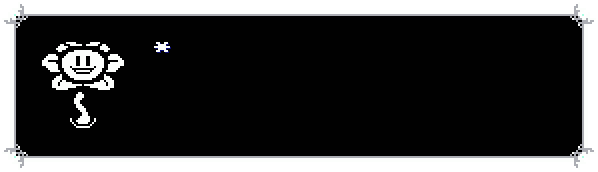
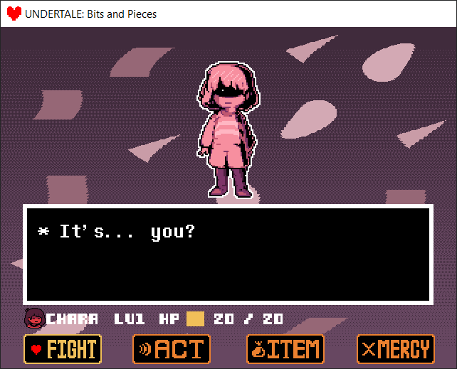
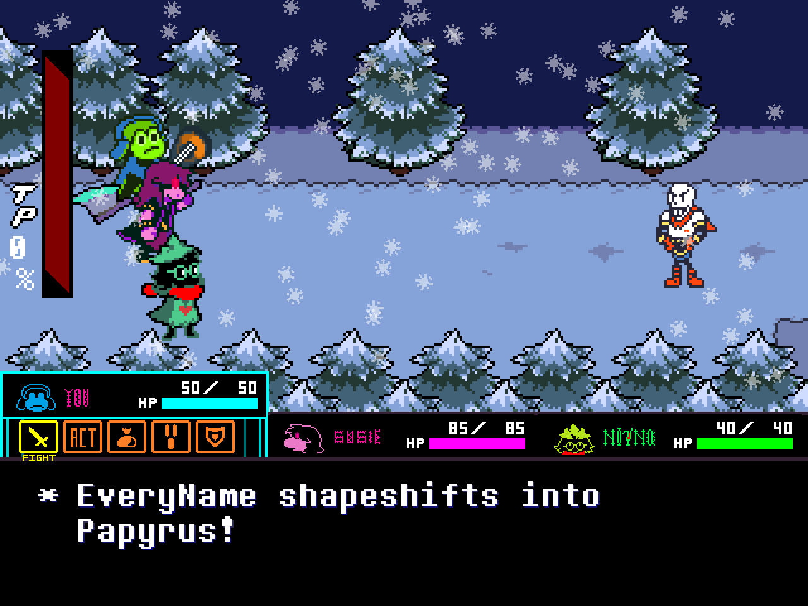

# UndertaleModTool

 

(seeing such an amazing tool fills you with DETERMINATION .)

Heya. I heard you like digging deep into GameMaker games like Undertale/Deltarune, so here's a tool just for you!

# Downloads

Both the latest stable release and the most cutting edge version can be downloaded from the table below!
Note, that you can update to the bleeding edge releases at any time from within the settings menu of UndertaleModTool.  

| Releases 	| Status 	|
|:---:	|----------	|
| Stable 	|  |
| Bleeding edge 	|  |

It's worth noting that UndertaleModTool has different builds per release. The differences are as follows:

* `.NET bundled` - bundles the required .NET runtime version needed to run the tool alongside it. All stable releases are .NET bundled, so you don't have to worry about installing the necessary runtime.
* `Single file` - the tool is only one executable, with all dependencies embedded within it. This does make your folders cleaner, however it also causes some unexpected stability issues.
* `Non-single File` - all dependencies are not embedded within the executable, but are now located right next to it. Choose this if you don't care about finding the right executable in-between of ~300 dll's, or if the stability issues from the `Single file` build affect you.

# Main Features

* Can read every single byte from the data file for lastest version of Undertale, Deltarune, and most other GameMaker: Studio games (GM:S 1.4 and GMS2 bytecode versions 13 to 17 are currently supported) for every platform and then recreate a byte-for-byte exact copy from the decoded data.
* Properly handles all of the pointers in the file so that if you add/remove stuff, make things longer/shorter, move them around etc. the file format won't break.
* An editor which lets you change (almost) every single value, including unknown ones.
* Includes a simple room/level editor.
* Allows for code disassembly and editing. This means you can add any custom code to the game, either using the built-in GML compiler or GML assembly.
* Experimental high-level decompiler. The output is accurate (except for the latest GameMaker versions), but it could use some more cleaning up of the high-level structures.
* Support for running scripts that automatically modify your data file (or perform other nefarious tasks) - this is the way to distribute mods, but creating them is a manual job for now. It also serves as a replacement for sharing hex editor offsets - if you make it into a file-format-aware script instead, there is much smaller change of it breaking after an update.
* All core IO functionality extracted into a library for use in external tools.
* Can generate an .yydebug file for the GM:S debugger so that you can edit variables live! (see [here](https://github.com/krzys-h/UndertaleModTool/wiki/Corrections-to-GameMaker-Studio-1.4-data.win-format-and-VM-bytecode,-.yydebug-format-and-debugger-instructions#yydebug-file-format))
* Automatic file associations for all GameMaker related files. This can be disabled by having a `dna.txt` file next to the executable.

# Screenshots

Here are some screenshots of what UTMT can do:

## [Undertale: Bits and Pieces Mod](https://gamejolt.com/games/UndertaleBnP/574044)

## [RIBBIT - The Deltarune Mod](https://gamejolt.com/games/ribbitmod/671888)

# Included Scripts

Included are some test scripts. They are, but not limited to:

* Universal:
  * Search: Simple search for text in decompiled code entries
  * Scripts to batch import and export various types of asset files.
* Undertale only:
  * EnableDebug: does just that, makes the global variable 'debug' be enabled at game start. If you don't know about Undertale's debug mode, check out [this write up of Undertale's Debug Mode](https://tcrf.net/Undertale/Debug_Mode)
  * DebugToggler: similar to the above, but instead toggles the debug mode on and off with F1
  * BorderEnabler: lets you import the PlayStation exclusive borders into the PC version and patches all version checks so that they display properly
  * testing: nothing important, just displays random text on the main menu - the first script I ever made
  * TTFFonts: Makes the game load fonts in TTF format from current directory instead of using the spritesheet fonts. You will need to track down all the font files yourself, I can't host them here for licensing reasons :(
  * RoomOfDetermination: Adds a new room to Undertale 1.08. I wanted to add something more to it but never got around to it, so I guess I'm releasing it as is. Just start the game and you'll see. Probably the most complete sample of adding stuff you'll find.
* Deltarune only:
  * DeltaHATE: [HATE](https://www.reddit.com/r/Undertale/comments/41lb16/hate_the_undertale_corruptor/)-inspired script for corrupting Deltarune
  * DeltaMILK: Replaces every non-background sprite with the K.Round healing milk. Don't ask why.
  * TheWholeWorldRevolving: The world is spinning, spinning
* Undertale and Deltarune only:
  * GoToRoom: Replaces the debug mode functionality of the F3 button with a dialog that lets you jump to any room by ID
  * ShowRoomName: Displays the current room name and ID on screen in debug mode
 
Additionally, included are some community-made scripts. For more information, consult the [SCRIPTS.md](https://github.com/krzys-h/UndertaleModTool/blob/master/SCRIPTS.md) file.

# Contributing

All contributions are welcome! If you find a bug, a data file that does not load etc., please report it on the [issues page](https://github.com/krzys-h/UndertaleModTool/issues). Pull requests and help with decoding the format is welcome too! Here is a current list of stuff that needs to be worked on:

* Work on the profile system
* Decompiler improvements
* Add support for latest versions of GameMaker (notably, 2.3) - decompiler cannot function in most cases currently
* Eventually, making the GUI cross-platform if possible

# Compilation Instructions

In order to compile the repo yourself, the `.NET Core 6 SDK` or later is required.

The following projects can be compiled:  
- `UndertaleModLib`: The core library used by all other projects.
- `UndertaleModCli`: A command line interface for interacting with GameMaker data files and applying scripts. Currently is very primitive in what it can do.
- `UndertaleModTool`: The main graphical user interface for interacting with GameMaker data files. **Windows is required in order to compile this**.

#### Compiling Via IDE
- Open the `UndertaleModTool.sln` in the IDE of your choice (Visual Studio, JetBrains Rider, Visual Studio Code etc.)
- Select the project you want to compile
- Compile

#### Compiling Via Command Line
- Open a terminal and navigate to the directory of `UndertaleModTool.sln`
- Execute `dotnet publish <Project>` where `<Project>` is one of the projects listed above.
You can also provide arguments for compiling, such as `--no-self-contained` or `-c release`. For a full list of arguments, consult the [Microsoft Documentation](https://docs.microsoft.com/dotnet/core/tools/dotnet-publish).

# GameMaker Data File Format

Interested in the file and instruction format research I've done while working on this? Check out the [Wiki](https://github.com/krzys-h/UndertaleModTool/wiki)
for full details and documentation.

# Special thanks

Special thanks to everybody who did previous research on unpacking and decompiling Undertale, it was a really huge help:

* [Ulyssis' UNDERTALE decompilation research](https://pcy.ulyssis.be/undertale/)
* [Donkeybonks's GameMaker data.win Bytecode research](https://web.archive.org/web/20191126144953if_/https://github.com/donkeybonks/acolyte/wiki/Bytecode)
* [PoroCYon's Altar.NET](https://github.com/PoroCYon/Altar.NET)
* [WarlockD's GMdsam](https://github.com/WarlockD/GMdsam)

as well as all the other contributors:

  

And of course, special thanks to Toby Fox and the whole Undertale team for making the game(s) ;)
