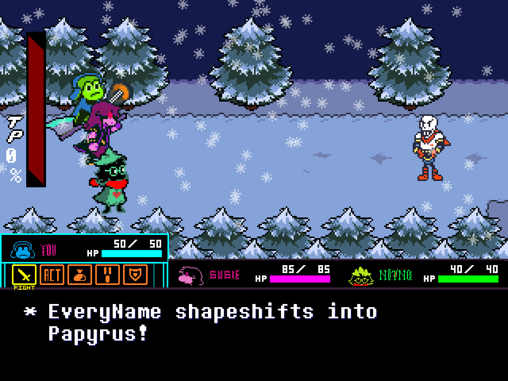
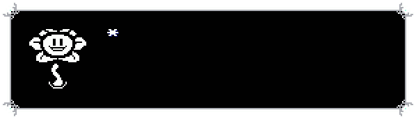

# UndertaleModTool

 

The most complete tool for modding, decompiling and unpacking Undertale (and other GameMaker games!)

> *\* (Seeing such a specialized tool, the culmination of work from many amazing contributors...)*

> *\* (It fills you with determination.)*

# Quick Start

## Windows

1. **Find** the latest stable release from the [Downloads](#downloads) section below
2. **Download** the GUI version (e.g. `UndertaleModTool_v0.8.4.1-Windows.zip`)
3. **Extract** the archive to a folder (do not run from inside the archive!)
4. **Run** `UndertaleModTool.exe`
5. **Open** your game's data file (e.g., `data.win`, `game.ios`) via File → Open
6. **Enjoy modding!**

## MacOS/Linux

Use the CLI version or install GUI via [community installer](https://github.com/YarTom/UndertaleModTool-linux-installer)

# Downloads

Both the latest stable release and the most cutting edge version can be downloaded from the table below!
The nightly releases are more likely to contain issues, but have the most recent features and fixes.

| Releases 	| Status 	|
|:---:	|----------	|
| Stable 	|  |
| Nightly 	|  |

## Versions:

### GUI Version (Graphical User Interface)
- **Windows (64-bit)** only
- Full graphical interface for convenient data file manipulation
- All built-in scripts available
- Recommended for most Windows users

* `Single file` - the tool is only one executable, with all dependencies embedded within it. This does make your folders cleaner, however it also causes some unexpected stability issues.
* `Non-single file` - all dependencies are not embedded within the executable, but are now located right next to it. Choose this if you don't care about finding the right executable in-between of ~300 DLL files, or if the stability issues from the `Single file` build affect you.

### CLI Version (Command Line Interface)
- **Cross-platform release** — Windows, Ubuntu, macOS
- Command-line version without a graphical interface
- Recommended for task automation

### GUI for macOS and Linux

The official GUI version only supports Windows. **MacOS** and **Linux** users can use UndertaleModTool via [Wine](https://winehq.org). 

Community-maintained auto-installer is available:

**Unofficial Installer for MacOS and Linux:** [UndertaleModTool-installer](https://github.com/YarTom/UndertaleModTool-linux-installer)

# Main Features

* Can read every single byte from the data file for latest versions of Undertale, Deltarune, and most other GameMaker games, and then recreate a byte-for-byte exact copy from the decoded data.
* Properly handles all of the pointers in the file so that if you add/remove stuff, make things longer/shorter, move them around, etc., the file format won't break.
* An editor which lets you change (almost) every single value, including unknown ones.
* Includes a simple room/level editor.
* Allows for GML VM code editing. This means you can add any custom code to a game, either using the built-in GML compiler or GML assembly. (YYC is not supported for this.)
* High-level GML decompiler and compiler. Supports a large range of GameMaker versions, and most important GML features (still missing a few).
* Support for running scripts that automatically modify your data file (or perform other nefarious tasks). This can be used for mod distribution, aside from other methods such as file patches/project systems.
* All core functionality extracted into a library for use in external tools.
* Can generate a `.yydebug` file for the GM:S debugger so that you can edit variables live! (see [here](https://github.com/UnderminersTeam/UndertaleModTool/wiki/Corrections-to-GameMaker-Studio-1.4-data.win-format-and-VM-bytecode,-.yydebug-format-and-debugger-instructions#yydebug-file-format))
* Automatic file associations for all GameMaker related data files. This is opt-in at the first boot of the tool, and can also be disabled by having a `dna.txt` file next to the executable.

# Screenshots

Here are some screenshots of what UTMT can do:

## [RIBBIT - The Deltarune Mod](https://gamejolt.com/games/ribbitmod/671888)

# Included Scripts

UndertaleModTool comes with a decently-sized collection of C# scripts that extend its functionality.
For more information on them, consult the [SCRIPTS.md](https://github.com/UnderminersTeam/UndertaleModTool/blob/master/SCRIPTS.md) file.

# Contributing

All contributions are welcome! If you find a bug, a data file that does not load etc., please report it on the [issues page](https://github.com/UnderminersTeam/UndertaleModTool/issues). Pull requests are welcome too! Here is a current list of stuff that needs to be worked on:

* Upgrading profile system to a better, more source-control friendly project system.
* Continuing to improve support for a wider variety of GameMaker versions (especially recent ones).
* Further GML compiler and decompiler work, mainly over on [Underanalyzer](https://github.com/UnderminersTeam/Underanalyzer).
* Making structural changes to clean up the library (an incremental effort).
* Eventually, making the GUI cross-platform if possible, and improving it in general.
* General usability improvements, bugfixes, and so on.

# Compilation Instructions

In order to compile the repo yourself, the `.NET Core 10 SDK` or later is required.

When cloning using Git, make sure to recursively clone submodules (e.g. with `--recurse-submodules`), as a submodule is used for the `Underanalyzer` dependency.

The following projects can be compiled:  
- `UndertaleModLib`: The core library used by all other projects.
- `UndertaleModCli`: A command line interface for interacting with GameMaker data files and applying scripts. Currently is very primitive in what it can do.
- `UndertaleModTool`: The main graphical user interface for interacting with GameMaker data files. **Windows is required in order to compile this**.

#### Compiling Via IDE
- Open the `UndertaleModTool.sln` in the IDE of your choice (Visual Studio, JetBrains Rider, Visual Studio Code etc.)
- Select the project you want to compile
- Compile

#### Compiling Via Command Line
- Open a terminal and navigate to the directory of `UndertaleModTool.sln`
- Execute `dotnet publish <Project>` where `<Project>` is one of the projects listed above.
You can also provide arguments for compiling, such as `--no-self-contained` or `-c release`. For a full list of arguments, consult the [Microsoft Documentation](https://docs.microsoft.com/dotnet/core/tools/dotnet-publish).

# GameMaker Data File Format

Interested in the file and instruction format research I've done while working on this? Check out the [Wiki](https://github.com/UnderminersTeam/UndertaleModTool/wiki)
for full details and documentation.

# Special thanks

Special thanks to everybody who did previous research on unpacking and decompiling Undertale, it was a really huge help:

* [PoroCYon's UNDERTALE decompilation research, maintained by Tomat](https://tomat.dev/undertale)
* [Donkeybonks's GameMaker data.win Bytecode research](https://web.archive.org/web/20191126144953if_/https://github.com/donkeybonks/acolyte/wiki/Bytecode)
* [PoroCYon's Altar.NET](https://github.com/PoroCYon/Altar.NET)
* [WarlockD's GMdsam](https://github.com/WarlockD/GMdsam)

as well as all the other contributors:

  

And of course, special thanks to Toby Fox and the whole Undertale team for making the game(s) ;)

